<!-- Header -->
<div align="center">
  
</div>

<div align="center">
  <h1>Vivian Chiamaka Okose</h1>
  <h3>DevOps Engineer &nbsp;|&nbsp; AWS &nbsp;•&nbsp; Kubernetes &nbsp;•&nbsp; Terraform &nbsp;•&nbsp; CI/CD</h3>
  <p>
    <a href="https://viviancloud.site">
      
    </a>
    &nbsp;
    <a href="https://www.linkedin.com/in/okosechiamaka/">
      
    </a>
    &nbsp;
    <a href="https://dev.to/vivian_okose">
      
    </a>
    &nbsp;
    <a href="https://hashnode.com/@vivianokose">
      
    </a>
  </p>
</div>

---

I build production-grade cloud infrastructure on AWS. My background is in Biochemistry and Biotechnology, not Computer Science. That scientific training shaped how I approach infrastructure: methodical, documented, reproducible. If it cannot be reproduced exactly, it is not done right.

I have been building in DevOps since early 2025. Every project is documented publicly.

---

## Featured Project: Agentic AWS Deployment Pipeline

A production-grade agentic DevOps pipeline built from scratch using Claude Code, Terraform, and a hook-based safety system.

```
Environment → CLAUDE.md → Skills → Live Deploy → SubAgents → MCP → Safety Hooks
```

| Component | What It Does |
|---|---|
| `CLAUDE.md` | Persistent project memory — agent knows architecture, conventions, constraints |
| `/scaffold-terraform` | Generates complete Terraform config from a template spec |
| `/tf-plan` | Validates, plans, scans for destructions, returns plain-English summary |
| `/tf-apply` | Applies saved plan and provisions real AWS resources |
| `/deploy` | Syncs to S3, triggers CloudFront invalidation, reports live URL |
| `security-auditor` | Read-only SubAgent: audits Terraform for misconfigurations |
| `tf-writer` | Read-write SubAgent: generates Terraform using live MCP provider schema |
| `cost-optimizer` | Read-only SubAgent: reviews infrastructure for cost inefficiencies |
| SAY hook | Blocks destructive prompts before Claude processes them |
| DO hook | Blocks dangerous tool calls before they execute |
| LOG hook | Writes timestamped entry to deploy.log on every terraform apply |

**The principle:** Minimal permissions are architecture, not policy. An AI agent that cannot exceed its scope is safer than one that relies on the engineer remembering the right constraints.

**Live site:** [viviancloud.site](https://viviancloud.site) &nbsp;|&nbsp; **Stack:** Claude Code • Terraform • AWS S3 • CloudFront • MCP • Bash • WSL2

---

## Other Projects

### Google Online Boutique on AWS EKS

Deployed an 11-service e-commerce application to AWS EKS from scratch. Terraform provisions the VPC, EKS cluster, and node groups. GitHub Actions builds all 11 Docker images in parallel and pushes to ECR. ArgoCD handles GitOps sync. Prometheus and Grafana handle monitoring. Debugged pod scheduling failures, CI race conditions, and EKS auth issues end to end.

**Stack:** AWS EKS • Terraform • GitHub Actions • ArgoCD • Helm • Prometheus • Grafana • Docker

---

### PetClinic Microservices on Kubernetes (Team Lead)

Led a team of 11 engineers to deploy a 12-service Spring Boot microservices application to a managed Kubernetes cluster. CI/CD pipeline takes a code change from pull request to production in under 8 minutes. Configured Kubernetes Network Policies, Secrets management, rollback procedures, and full Prometheus/Grafana monitoring with live alerting.

**Stack:** AWS EKS • Kubernetes • Terraform • GitHub Actions • Helm • Prometheus • Grafana • Docker

---

### Three-Tier Cloud Application (CloudAdvisory)

Designed and deployed a production-grade, three-tier application on AWS. Custom VPC across 2 Availability Zones, Next.js frontend behind a public ALB, Node.js backend on private EC2, Amazon RDS with read replica. Replaced bastion hosts entirely with AWS SSM Session Manager — zero open ports.

**Stack:** AWS EC2 • ALB • RDS • VPC • IAM • SSM • Terraform

---

### Ansible and Jenkins Infrastructure Automation

Built a Jenkins-Ansible control server to automate configuration across web, NFS, DB, and load balancer servers on AWS. Solved OS mismatch issues between RHEL and Ubuntu nodes using inventory grouping and OS-aware Ansible tasks.

**Stack:** Jenkins • Ansible • AWS • GitHub Actions • Bash

→ [View Repository](https://github.com/vivianokose/ansible-config-mgt)

---

## Tech Stack

### Agentic AI and Automation


### Cloud and Infrastructure

<p>
  
</p>

### CI/CD and GitOps

<p>
  
</p>

### Monitoring

<p>
  
</p>

### Scripting and OS

<p>
  
</p>

---

## GitHub Stats

<div align="center">
  
  &nbsp;
  
</div>

<div align="center">
  
</div>

---

## Technical Writing

I document everything publicly. Real problems, real debugging, real fixes.

- **Portfolio:** [viviancloud.site](https://viviancloud.site)
- **Dev.to:** [dev.to/vivian_okose](https://dev.to/vivian_okose)
- **Hashnode:** [hashnode.com/@vivianokose](https://hashnode.com/@vivianokose)
- **Medium:** [medium.com/@vivianokose](https://medium.com/@vivianokose)
- **LinkedIn:** [linkedin.com/in/okosechiamaka](https://www.linkedin.com/in/okosechiamaka/)

---

## Connect

<div align="center">
  <a href="https://viviancloud.site">
    
  </a>
  &nbsp;
  <a href="https://www.linkedin.com/in/okosechiamaka/">
    
  </a>
  &nbsp;
  <a href="mailto:vivianokose@gmail.com">
    
  </a>
</div>

---

<div align="center">
  <p>
    <em>"Safety is architecture, not discipline."</em><br/>
    <small>Available for DevOps Engineering, Cloud Infrastructure, SRE, and Platform Engineering roles. Remote or relocation.</small>
  </p>
</div>

<!-- Footer -->
<div align="center">
  
</div>
